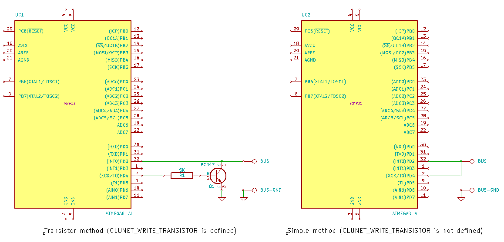

#CLUNET

CLUNET library - simple 1-wire peer-to-peer network for AVR microcontrollers. Perfect way to interconnect microcontrollers in your house.

* Only few cheap additional components
* Using only 1 wire
* Using only 2 pins
* There is no master device, all devices are equal
* You can use very long cable, up to 100 meters and more
* You don't need to care about collisions
* Pseudo multitask using interrupts
* Up to 255 devices on one bus

##How to use
###Hardware part

You need pin with external interrupt to read data and any other pin to send data. Transistor method is recommended. 

###Software part
You will need one free 8-bit timer with output compare match and overflow interrupts.

####Configuration####
Edit *clunet\_config.h* and change some values:

* **CLUNET\_DEVICE\_ID** - address of device (0-254)
* **CLUNET\_DEVICE\_NAME** - name of device (optional)
* **CLUNET\_SEND\_BUFFER\_SIZE** - send buffer size and maximum outpus packet size (memory usage)
* **CLUNET\_READ\_BUFFER\_SIZE** - read buffer size and maximum input packet size (memory usage)
* **CLUNET\_WRITE\_PORT** and **CLUNET\_WRITE\_PIN** - port and pin to send data
* **CLUNET\_READ\_PORT** and **CLUNET\_READ\_PIN** - port and pin to send read data, should be connected directly to line
* **CLUNET\_WRITE\_TRANSISTOR** - define if you are using transistor on outpun pin (see schematics)
* **CLUNET\_TIMER\_PRESCALER** - prescaler for timer, define it to autocalculate CLUNET_T value as 64us, it *MUST* match timer initialization code, `(F_CPU / CLUNET_TIMER_PRESCALER) / 15625` *MUST* be >= 8 and <= 24, so 64 is great value for 8MHz
* **CLUNET\_T** - T value, it's time between signals in timer ticks, length of logical 0 is T, and logical 1 is 3*T, lowet T is faster and higher T is more stable, it's autocalculated as 64us based on **CLUNET\_TIMER\_PRESCALER** if not defined
* **CLUNET\_TIMER\_INIT** - code to init timer (normal mode)
* **CLUNET\_TIMER\_REG** - timer/counter register
* **CLUNET\_TIMER\_REG\_OCR** - timer/counter output compare register
* **CLUNET\_ENABLE\_TIMER\_COMP** and **CLUNET\_DISABLE\_TIMER\_COMP** - code to enable/disable timer output compare match interrupt
* **CLUNET\_ENABLE\_TIMER\_OVF** and **CLUNET\_DISABLE\_TIMER\_OVF** - code to enable/disable timer overflow interrupt
* **CLUNET\_INIT\_INT** - code to init external interrupt (read pin)
* **CLUNET\_TIMER\_COMP\_VECTOR** - timer output compare match interrupt vector
* **CLUNET\_TIMER\_OVF\_VECTOR** - timer overflow interrupt vector
* **CLUNET\_INT\_VECTOR** - external interrupt vector

Sample configuration file is great for ATMEGA8 / 8MHz.

####Code
Include "clunet.h" and create callback function to receive data:

    #include "clunet.h"
    
    void data_received(unsigned char src_address, unsigned char dst_address, unsigned char command, char* data, unsigned char size)
    {
    	/* your code here */
    }

Add initialization code and enable interrupts:

    int main (void)
    {
    	clunet_init();
    	clunet_set_on_data_received(data_received);	
    	sei();

Also you can use *clunet_set_on_data_received_sniff()* to set callback function which will receive all packets, not only for this device.

Function to send data:

	void clunet_send(unsigned char address, unsigned char prio, unsigned char command, char* data, unsigned char size);

* **address** - address of destination device or *CLUNET_BROADCAST_ADDRESS* for multicast
* **prio** - packet priority: *CLUNET\_PRIORITY\_NOTICE* (1), *CLUNET\_PRIORITY\_INFO* (2), *CLUNET\_PRIORITY\_MESSAGE* (3) or *CLUNET\_PRIORITY\_COMMAND* (4)
* **command** - command ID (0-255), there is some predefined (see *clunet.h*) and reserved commands (see below)
* **data** - pointer to data if any
* **size** - data size

Sample code:

	char buffer[1];
	buffer[0] = 1;
	clunet_send(CLUNET_BROADCAST_ADDRESS, CLUNET_PRIORITY_MESSAGE, CLUNET_COMMAND_DEVICE_POWER_INFO, buffer, sizeof(buffer));
	
	while (clunet_ready_to_send()); // wait while sending otherwise next call will replace output buffer
	// clunet_ready_to_send() returns current task priority or 0 if output buffer is not busy

	char *hello = "Hello world!";
	clunet_send(1, CLUNET_PRIORITY_INFO, 100, hello, sizeof(hello));

####Reserved commands
There is some reserved commands:

* **CLUNET\_COMMAND\_DISCOVERY** (0x00) - send this command as broadcast packet to find all devices in your network, devices will answer with command **CLUNET\_COMMAND\_DISCOVERY\_RESPONSE** (0x01) and **CLUNET\_DEVICE\_NAME** in data section
* **CLUNET\_COMMAND\_REBOOT** (0x02) - send this command to reboot device
* **CLUNET\_COMMAND\_BOOT\_CONTROL** - (0x03) reserved for bootloader and firmware update
* **CLUNET\_COMMAND\_BOOT\_COMPLETED** (0x04) - sent by device on start (call of *clunet_init()*), data is value of *MCUCSR* register, so your can determine reset source
* **CLUNET\_COMMAND\_PING** (0xFE) - ping, you can test line using this command, device(s) will answer with **CLUNET\_COMMAND\_PING\_REPLY** (0xFF) and same data

##Tested on
* ATMEGA
* ATMEGA16
* ATMEGA64

##Known bugs/problems
* Any data on bus will slow down a bit every connected device
* No delivery check, you can made it in your application code if required

## Author/contacts

**Alexey 'Cluster' Avdyukhin** 
clusterrr@clusterrr.com 
[https://github.com/ClusterM](https://github.com/ClusterM "https://github.com/ClusterM") 
[http://clusterrr.com](http://clusterrr.com "http://clusterrr.com")
